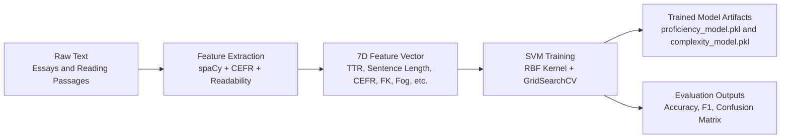
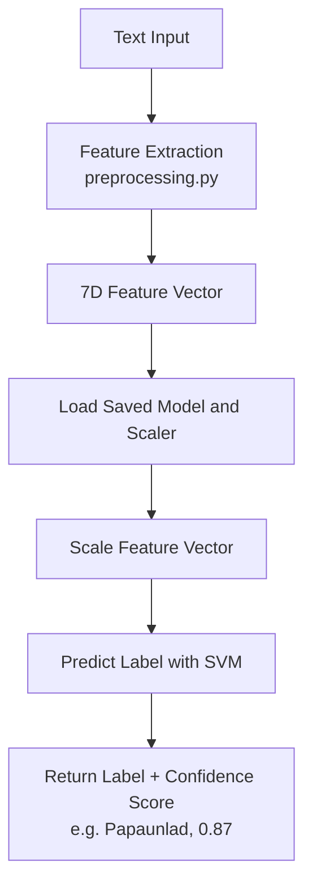
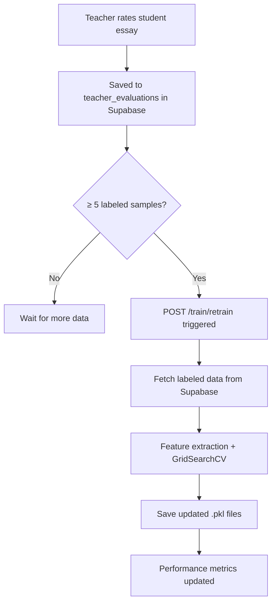

# ReadTrack ML Training Pipeline

This document explains the machine learning pipeline used in ReadTrack for text complexity and student proficiency analysis.

---

## Overview

ReadTrack uses **Support Vector Machine (SVM)** classifiers trained with scikit-learn to analyze text. The system includes two main models:

| Model | Purpose | Output Labels |
|-------|---------|---------------|
| **Student Proficiency Model** | Assesses student writing ability (DepEd scale) | Nagsisimula, Papaunlad, Mahusay |
| **Text Complexity Model** | Measures reading material difficulty | Literal, Inferential, Evaluative |

---

## Training Pipeline



---

## Step 1: Feature Extraction

Every text is converted into a **24-dimensional numerical vector** using NLP techniques. Feature extraction happens in `preprocessing.py` using spaCy (`en_core_web_sm`) and CEFRpy linguistic analysis.

### Extracted Features

**Base Features (18)**

| # | Feature | Description | How It's Calculated |
|---|---------|-------------|---------------------|
| 1 | **TTR (Type-Token Ratio)** | Lexical diversity | Unique words ÷ Total words |
| 2 | **Avg Sentence Length** | Syntactic complexity | Total words ÷ Number of sentences |
| 3 | **Difficult Word Ratio** | Word-level difficulty | % of words with >9 characters × 100 |
| 4 | **Clause Density** | Grammatical complexity | Verbs per sentence |
| 5 | **Advanced CEFR Ratio** | Vocabulary proficiency | C1/C2 word count ÷ Total words |
| 6 | **Flesch-Kincaid Grade** | Readability metric | Standard FK formula |
| 7 | **Gunning Fog Index** | Prose complexity | Measures text "fog" |
| 8 | **Verb Ratio** | Grammatical density | Verbs ÷ Total words |
| 9 | **Noun Ratio** | Nominal density | Nouns ÷ Total words |
| 10 | **Adjective Ratio** | Descriptive density | Adjectives ÷ Total words |
| 11 | **Avg Dependency Distance** | Syntactic complexity | Mean token–head distance in parse tree |
| 12 | **Word Count** | Text length | Total alpha tokens |
| 13 | **Sentence Count** | Text structure | Total sentences |
| 14 | **Sentence Length Std Dev** | Sentence burstiness | Std deviation of per-sentence word counts |
| 15 | **Punctuation Density** | Writing maturity | Punctuation marks ÷ Total words |
| 16 | **Stopword Ratio** | Functional word usage | Stopwords ÷ Total words |
| 17 | **Avg Word Length** | Vocabulary complexity | Mean character count per word |
| 18 | **Syllables per Word** | Phonological complexity | Total syllables ÷ Total words |

**CEFR Distribution Features (6)**

| # | Feature | Description |
|---|---------|-------------|
| 19 | **A1 Ratio** | Basic beginner vocabulary proportion |
| 20 | **A2 Ratio** | Elementary vocabulary proportion |
| 21 | **B1 Ratio** | Intermediate vocabulary proportion |
| 22 | **B2 Ratio** | Upper-intermediate vocabulary proportion |
| 23 | **C1 Ratio** | Advanced vocabulary proportion |
| 24 | **C2 Ratio** | Mastery vocabulary proportion |

### CEFR Vocabulary Analysis

The system uses `cefrpy` to classify each word into CEFR levels (**English only**). Each ratio = count of words at that level ÷ total word count.

### Filipino Text Feature Extraction

For Filipino text (`language != "en"`), the code currently still uses the English spaCy model (`en_core_web_sm`) for tokenization and POS tagging. All CEFR-related features (5, 19–24) are set to **0** since CEFRpy does not support Filipino.

> **Known limitation**: Using an English POS model on Filipino text produces inaccurate POS tags, which makes POS-derived features (verb ratio, noun ratio, adjective ratio, clause density, avg dependency distance) unreliable for Filipino essays.

> **calamanCy** (`tl_calamancy_md`) is already loaded in `tagalog_service.py` and returns a full spaCy `Doc` object with accurate Filipino POS tags, lemmas, and dependency parses — but it is not yet wired into `preprocessing.py`. It should be used here instead of `en_core_web_sm` for Filipino text.

Effective dimensionality for Filipino: 24 features, 7 of which are always 0 (Advanced CEFR Ratio + 6 CEFR level ratios).

---

## Step 2: Data Preparation

### Student Proficiency Model

**Initial Training Dataset**: ASAP2 (Automated Student Assessment Prize) essay dataset

**Label Mapping** (Score → DepEd Reading Level):

| ASAP Score | DepEd Level |
|------------|-------------|
| 6 | Mahusay (Independent) |
| 3–5 | Papaunlad (Instructional) |
| 1–2 | Nagsisimula (Frustration) |

**Continuous Retraining**: After initial training, the proficiency model is retrained using teacher-rated essays stored in the Supabase `teacher_evaluations` table. A minimum of **5 labeled samples** is required to trigger retraining.

**Data Loading** (`train_utils.py`):
```python
# Essays are processed in parallel for efficiency
results = Parallel(n_jobs=-1)(
    delayed(process_single_essay)(row) for _, row in df.iterrows()
)
```

### Text Complexity Model

**Dataset**: CommonLit Readability dataset

**Label Mapping** (Flesch-Kincaid → Complexity):

| FK Grade Level | Complexity |
|----------------|------------|
| < 12.0 | Literal |
| 12.0–15.0 | Inferential |
| ≥ 15.0 | Evaluative |

---

## Step 3: Data Preprocessing

### Feature Scaling

Features are normalized using **RobustScaler** (for proficiency) or **StandardScaler** (for complexity) to handle outliers and ensure equal feature contribution:

```python
scaler = RobustScaler()
X_train_scaled = scaler.fit_transform(X_train)
X_test_scaled = scaler.transform(X_test)
```

### Train-Test Split

Data is split 80/20 for training and evaluation:

```python
X_train, X_test, y_train, y_test = train_test_split(
    X, y, test_size=0.2, random_state=174
)
```

---

## Step 4: Model Training

### SVM with RBF Kernel

Both models use **Support Vector Classification (SVC)** with an **RBF (Radial Basis Function)** kernel, effective for non-linear classification problems.

### Hyperparameter Tuning (GridSearchCV)

The proficiency model uses exhaustive grid search to find optimal parameters:

```python
param_grid = {
    'C': [10, 50, 100, 500, 1000],        # Regularization
    'gamma': ['scale', 0.01, 0.05, 0.1],  # Kernel coefficient
    'class_weight': ['balanced', None]     # Handle class imbalance
}

grid_search = GridSearchCV(
    SVC(kernel='rbf', random_state=42),
    param_grid,
    cv=3,              # 3-fold cross-validation
    scoring='accuracy',
    n_jobs=-1          # Use all CPU cores
)
```

This tests **40 different combinations** (5 × 4 × 2) to find the best configuration.

### Complexity Model Training

Uses the `TextComplexitySVM` class with built-in training:

```python
complexity_model = TextComplexitySVM()
complexity_model.train(X_train, y_train)
```

---

## Step 5: Model Evaluation

### Metrics Calculated

| Metric | Description |
|--------|-------------|
| **Accuracy** | Overall correct predictions |
| **Precision** | True positives / (True positives + False positives) |
| **Recall** | True positives / (True positives + False negatives) |
| **F1 Score** | Harmonic mean of precision and recall |

### Confusion Matrix

Visual confusion matrices are generated and saved:

```python
cm = confusion_matrix(y_test, y_pred)
sns.heatmap(cm, annot=True, fmt='d', cmap='Blues')
plt.savefig('confusion_matrix.png')
```

Performance metrics are also exposed via the API:

```
GET /train/performance
Response: {
    "proficiency": { "accuracy": 0.88, "f1": 0.86 },
    "complexity":  { "accuracy": 0.91, "f1": 0.89 }
}
```

---

## Step 6: Model Serialization

Trained models are saved as `.pkl` files using pickle:

```python
with open('models/proficiency_model.pkl', 'wb') as f:
    pickle.dump({
        'model': best_model,  # The trained SVM
        'scaler': scaler      # The fitted scaler
    }, f)
```

Both the model and scaler are saved together because the scaler parameters are needed at inference time.

---

## Running the Training

### Train All Models

```bash
cd backend
python train_models.py
```

### Train Individual Models

```bash
# Proficiency model only
python train_proficiency.py

# Complexity model only
python train_complexity.py
```

### Trigger Retraining via API (uses Supabase data)

```bash
curl -X POST http://localhost:8000/train/retrain
```

### Output Files

After training, the following files are created:

```
backend/models/
├── proficiency_model.pkl           # Trained proficiency SVM
├── complexity_model.pkl            # Trained complexity SVM
├── proficiency_confusion_matrix.png
├── complexity_confusion_matrix.png
└── evaluation_metrics.json         # Performance metrics
```

---

## Model Inference Flow

When analyzing new text:



---

## Retraining Flow (Supabase-Driven)



---

## Fallback System

If model files are missing, the system uses **heuristic scoring** as a fallback:

```python
# Proficiency heuristic
score = (vocab_richness * 0.4) + (structure_cohesion * 0.6) + cefr_boost

if score >= 80:
    proficiency = "Mahusay"
elif score >= 50:
    proficiency = "Papaunlad"
else:
    proficiency = "Nagsisimula"
```

This ensures the application remains functional even without trained model files.

---

## Target Performance

| Model | Target Accuracy |
|-------|-----------------|
| Proficiency | ≥ 85% |
| Complexity | Best achievable |

---

## Summary

1. **Feature Engineering**: Text → 7 linguistic features (TTR, sentence length, CEFR, etc.)
2. **Initial Data**: ASAP2 essays (proficiency), CommonLit texts (complexity)
3. **Continuous Data**: Teacher-rated essays from Supabase `teacher_evaluations`
4. **Algorithm**: SVM with RBF kernel
5. **Optimization**: GridSearchCV with 3-fold cross-validation
6. **Output Labels**: DepEd scale (Nagsisimula / Papaunlad / Mahusay) for proficiency; Literal / Inferential / Evaluative for complexity
7. **Serialization**: `.pkl` files with model + scaler bundled
8. **Fallback**: Heuristic scoring if models unavailable
