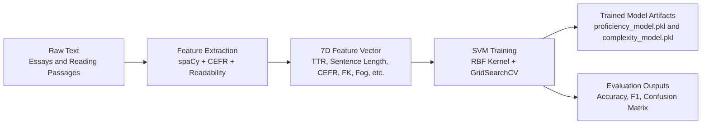
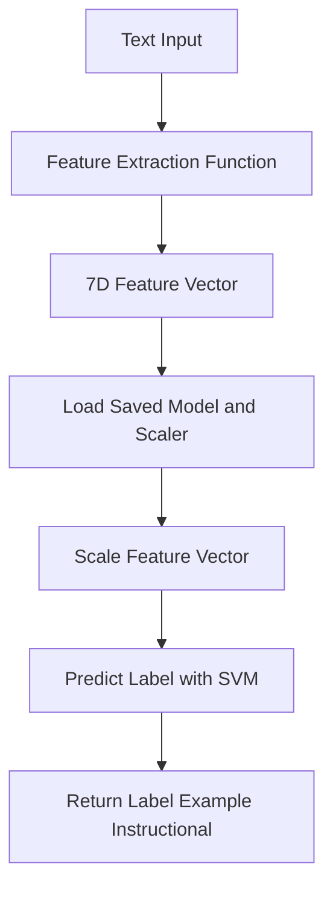

# How the ReadTrack Models Are Trained

This document explains the machine learning pipeline used in ReadTrack for text complexity and student proficiency analysis.

---

## Overview

ReadTrack uses **Support Vector Machine (SVM)** classifiers trained with scikit-learn to analyze text. The system includes two main models:

| Model | Purpose | Output Labels |
|-------|---------|---------------|
| **Student Proficiency Model** | Assesses student writing ability | Independent, Instructional, Frustration |
| **Text Complexity Model** | Measures reading difficulty | Literal, Inferential, Evaluative |

---

## Training Pipeline



---

## Step 1: Feature Extraction

Every text is converted into a **7-dimensional numerical vector** using NLP techniques. The feature extraction happens in `preprocessing.py` using spaCy and CEFR linguistic analysis.

### Extracted Features

| # | Feature | Description | How It's Calculated |
|---|---------|-------------|---------------------|
| 1 | **TTR (Type-Token Ratio)** | Lexical diversity | Unique words ÷ Total words |
| 2 | **Avg Sentence Length** | Syntactic complexity | Total words ÷ Number of sentences |
| 3 | **Difficult Word Ratio** | Word-level difficulty | % of words with >9 characters |
| 4 | **Clause Density** | Grammatical complexity | Verbs per sentence |
| 5 | **Advanced CEFR Ratio** | Vocabulary proficiency | % of C1/C2 level words |
| 6 | **Flesch-Kincaid Grade** | Readability metric | Standard FK formula |
| 7 | **Gunning Fog Index** | Prose complexity | Measures text "fog" |

### CEFR Vocabulary Analysis

The system uses `cefrpy` to classify each word into CEFR levels:
- **A1-A2**: Basic vocabulary
- **B1-B2**: Independent user vocabulary
- **C1-C2**: Proficient/Advanced vocabulary

---

## Step 2: Data Preparation

### Student Proficiency Model

**Dataset**: ASAP2 (Automated Student Assessment Prize) essay dataset

**Data Loading** (`train_utils.py`):
```python
# Essays are processed in parallel for efficiency
results = Parallel(n_jobs=-1)(
    delayed(process_single_essay)(row) for _, row in df.iterrows()
)
```

**Label Mapping** (Score → Phil-IRI Level):
| ASAP Score | Phil-IRI Level |
|------------|----------------|
| 6 | Independent |
| 3-5 | Instructional |
| 1-2 | Frustration |

### Text Complexity Model

**Dataset**: CommonLit Readability dataset

**Label Mapping** (Flesch-Kincaid → Complexity):
| FK Grade Level | Complexity |
|----------------|------------|
| < 12.0 | Literal |
| 12.0 - 15.0 | Inferential |
| ≥ 15.0 | Evaluative |

---

## Step 3: Data Preprocessing

### Feature Scaling

Features are normalized using **RobustScaler** (for proficiency) or **StandardScaler** (for complexity) to handle outliers and ensure all features contribute equally:

```python
scaler = RobustScaler()
X_train_scaled = scaler.fit_transform(X_train)
X_test_scaled = scaler.transform(X_test)
```

### Train-Test Split

Data is split 80/20 for training and evaluation:

```python
X_train, X_test, y_train, y_test = train_test_split(
    X, y, test_size=0.2, random_state=174
)
```

---

## Step 4: Model Training

### SVM with RBF Kernel

Both models use **Support Vector Classification (SVC)** with an **RBF (Radial Basis Function)** kernel, which is effective for non-linear classification problems.

### Hyperparameter Tuning (GridSearchCV)

The proficiency model uses exhaustive grid search to find optimal parameters:

```python
param_grid = {
    'C': [10, 50, 100, 500, 1000],        # Regularization
    'gamma': ['scale', 0.01, 0.05, 0.1],  # Kernel coefficient
    'class_weight': ['balanced', None]     # Handle class imbalance
}

grid_search = GridSearchCV(
    SVC(kernel='rbf', random_state=42),
    param_grid,
    cv=3,              # 3-fold cross-validation
    scoring='accuracy',
    n_jobs=-1          # Use all CPU cores
)
```

This tests **40 different combinations** (5 × 4 × 2) to find the best configuration.

### Complexity Model Training

Uses the `TextComplexitySVM` class with built-in training:

```python
complexity_model = TextComplexitySVM()
complexity_model.train(X_train, y_train)
```

---

## Step 5: Model Evaluation

### Metrics Calculated

| Metric | Description |
|--------|-------------|
| **Accuracy** | Overall correct predictions |
| **Precision** | True positives / (True positives + False positives) |
| **Recall** | True positives / (True positives + False negatives) |
| **F1 Score** | Harmonic mean of precision and recall |

### Confusion Matrix

Visual confusion matrices are generated and saved:

```python
cm = confusion_matrix(y_test, y_pred)
sns.heatmap(cm, annot=True, fmt='d', cmap='Blues')
plt.savefig('confusion_matrix.png')
```

---

## Step 6: Model Serialization

Trained models are saved as `.pkl` files using pickle:

```python
with open('models/proficiency_model.pkl', 'wb') as f:
    pickle.dump({
        'model': best_model,  # The trained SVM
        'scaler': scaler      # The fitted scaler
    }, f)
```

Both the model and scaler are saved together because the scaler parameters are needed at inference time.

---

## Running the Training

### Train All Models

```bash
cd backend
python train_models.py
```

### Train Individual Models

```bash
# Proficiency model only
python train_proficiency.py

# Complexity model only
python train_complexity.py
```

### Output Files

After training, the following files are created:

```
backend/models/
├── proficiency_model.pkl           # Trained proficiency SVM
├── complexity_model.pkl            # Trained complexity SVM
├── proficiency_confusion_matrix.png
├── complexity_confusion_matrix.png
└── evaluation_metrics.json         # Performance metrics
```

---

## Model Inference Flow

When analyzing new text:



---

## Fallback System

If model files are missing, the system uses **heuristic scoring** as a fallback:

```python
# Proficiency heuristic
score = (vocab_richness * 0.4) + (structure_cohesion * 0.6) + cefr_boost

if score >= 80:
    proficiency = "Independent"
elif score >= 50:
    proficiency = "Instructional"
else:
    proficiency = "Frustration"
```

This ensures the application remains functional even without trained models.

---

## Target Performance

| Model | Target Accuracy |
|-------|-----------------|
| Proficiency | ≥ 85% |
| Complexity | Best achievable |

---

## Summary

1. **Feature Engineering**: Text → 7 linguistic features (TTR, sentence length, CEFR, etc.)
2. **Data**: ASAP2 essays (proficiency), CommonLit texts (complexity)
3. **Algorithm**: SVM with RBF kernel
4. **Optimization**: GridSearchCV with 3-fold cross-validation
5. **Output**: Serialized `.pkl` files with model + scaler
6. **Fallback**: Heuristic scoring if models unavailable
