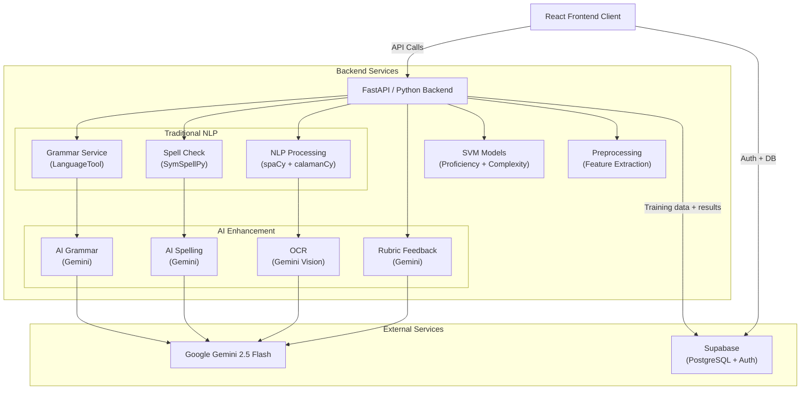
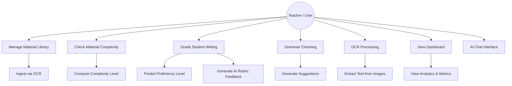
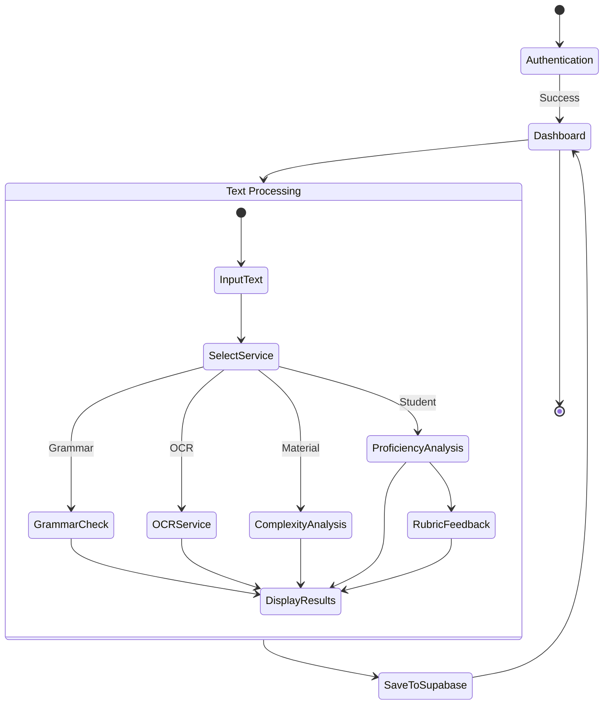
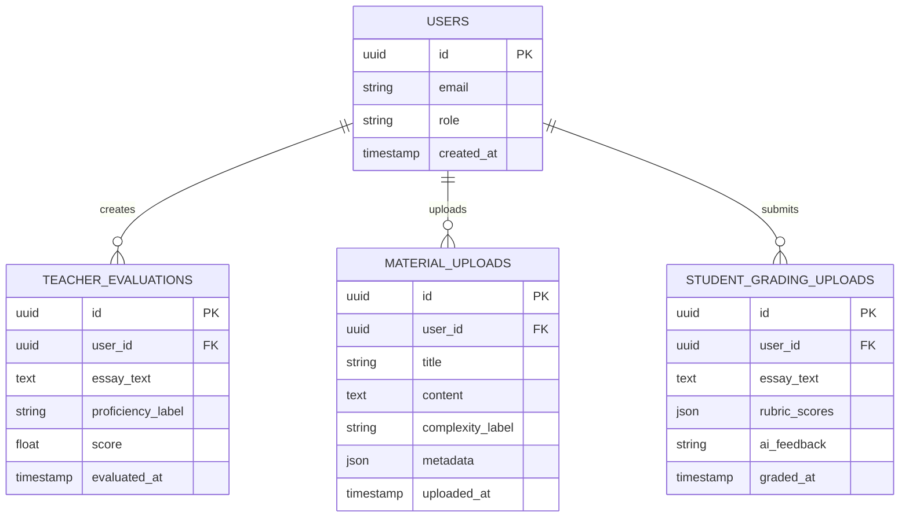

# ReadTrack System Documentation

**Version:** 2.0 (AI-Enhanced)
**Last Updated:** March 2026
**Target Audience:** Developers, System Administrators, and Educational Technologists

---

## 1. Executive Summary

**ReadTrack** is an intelligent reading and grammar analysis platform designed for Philippine education. It provides educators with advanced text analysis, student proficiency classification, material complexity scoring, and OCR-based ingestion — leveraging both traditional machine learning and generative AI. The system integrates Supabase for persistent storage and authentication, supports Filipino and English language processing, and continuously improves its ML models through teacher-rated feedback.

### Core Technology Stack

| Layer | Technology |
|-------|-----------|
| **Frontend** | React 19, TypeScript, Vite 6, React Router 7 |
| **Animations** | Framer Motion 12 |
| **Data Visualization** | Recharts 3 |
| **Backend** | Python, FastAPI, Uvicorn |
| **NLP (English)** | spaCy, NLTK, CEFRpy, LanguageTool-Python, SymSpellPy |
| **NLP (Filipino)** | calamanCy (POS tagging, NER, dependency parsing) |
| **Machine Learning** | scikit-learn (SVM), XGBoost, imbalanced-learn |
| **OCR** | Gemini Vision (Google Generative AI) |
| **AI Services** | Google Gemini 2.5 Flash |
| **Database & Auth** | Supabase (PostgreSQL + Auth) |
| **PDF Processing** | pypdf |

### Hybrid Architecture

ReadTrack uses a **hybrid approach** combining traditional NLP tools with generative AI:

- **Spelling Correction**: SymSpellPy for fast dictionary-based corrections + Gemini for context-aware suggestions
- **Grammar Checking**: LanguageTool for rules-based detection + Gemini for semantic corrections
- **Text Analysis**: spaCy (`en_core_web_sm`) for 24-dimensional linguistic feature extraction + SVM models for complexity and proficiency scoring
- **OCR**: Gemini Vision for accurate image text extraction and material ingestion
- **Student Feedback**: Gemini for rubric-based evaluation and detailed AI-generated feedback

This dual-layer approach ensures **speed, accuracy, and contextual understanding**.

---

## 2. System Architecture

The application follows a modular, service-oriented architecture for maintainability and scalability.


```mermaid
graph TD
    Client["React Frontend Client"]

    subgraph "Backend Services"
        API["FastAPI / Python Backend"]

        subgraph "Traditional NLP"
            Grammar["Grammar Service<br/>(LanguageTool)"]
            SpellCheck["Spell Check<br/>(SymSpellPy)"]
            NLP["NLP Processing<br/>(spaCy + calamanCy)"]
        end

        subgraph "AI Enhancement"
            GeminiSpell["AI Spelling<br/>(Gemini)"]
            GeminiGrammar["AI Grammar<br/>(Gemini)"]
            GeminiOCR["OCR<br/>(Gemini Vision)"]
            GeminiFeedback["Rubric Feedback<br/>(Gemini)"]
        end

        SVM["SVM Models<br/>(Proficiency + Complexity)"]
        Preprocessing["Preprocessing<br/>(Feature Extraction)"]
    end

    subgraph "External Services"
        Gemini["Google Gemini 2.5 Flash"]
        Supabase["Supabase<br/>(PostgreSQL + Auth)"]
    end

    Client -->|"API Calls"| API
    Client -->|"Auth + DB"| Supabase

    API --> Grammar
    API --> SpellCheck
    API --> NLP

    Grammar --> GeminiGrammar
    SpellCheck --> GeminiSpell
    NLP --> GeminiOCR
    API --> GeminiFeedback

    GeminiGrammar --> Gemini
    GeminiSpell --> Gemini
    GeminiOCR --> Gemini
    GeminiFeedback --> Gemini

    API --> SVM
    API --> Preprocessing
    API -->|"Training data + results"| Supabase
```

---

## 3. Data Inputs and Sources

| Data Type | Source | Usage | Format |
| :---- | :---- | :---- | :---- |
| **Student Essays** | Teacher Upload | Proficiency classification and rubric grading | Plain text, UTF-8 |
| **Reading Materials** | Teacher Upload / OCR | Text complexity analysis and library management | Plain text, PDF, images |
| **Image Files** | User Upload / Camera | OCR text extraction via Gemini Vision | `.jpg`, `.png` (Base64) |
| **PDF Files** | User Upload | Text extraction via pypdf | `.pdf` (Base64) |
| **Teacher Evaluations** | Supabase (`teacher_evaluations`) | ML model retraining data | JSON with ratings |
| **Material Uploads** | Supabase (`material_uploads`) | Reference library for complexity analysis | JSON with metadata |
| **Student Grading Data** | Supabase (`student_grading_uploads`) | Grading history and analytics | JSON with scores |
| **AI Prompts** | User Input | Rubric feedback generation via Gemini | Plain text |
| **AI Responses** | Google Gemini API | Feedback, grammar corrections, OCR | JSON |

---

## 4. System Modeling

### Use Case Diagram


```mermaid
graph TB
    Teacher((Teacher / User))

    Teacher --> MaterialLib[Manage Material Library]
    Teacher --> MaterialCheck[Check Material Complexity]
    Teacher --> StudentGrade[Grade Student Writing]
    Teacher --> GrammarCheck[Grammar Checking]
    Teacher --> OCRProcess[OCR Processing]
    Teacher --> Dashboard[View Dashboard]
    Teacher --> AIChat[AI Chat Interface]

    MaterialLib --> IngestOCR[Ingest via OCR]
    MaterialCheck --> ComplexityScore[Compute Complexity Level]
    StudentGrade --> ProficiencyScore[Predict Proficiency Level]
    StudentGrade --> RubricFeedback[Generate AI Rubric Feedback]
    GrammarCheck --> Suggestions[Generate Suggestions]
    OCRProcess --> ExtractText[Extract Text from Images]
    Dashboard --> Analytics[View Analytics & Metrics]
```

### System Activity Flow


```mermaid
stateDiagram-v2
    [*] --> Authentication
    Authentication --> Dashboard: Success

    state "Text Processing" as Processing {
        [*] --> InputText
        InputText --> SelectService
        SelectService --> GrammarCheck: Grammar
        SelectService --> OCRService: OCR
        SelectService --> ComplexityAnalysis: Material
        SelectService --> ProficiencyAnalysis: Student

        GrammarCheck --> DisplayResults
        OCRService --> DisplayResults
        ComplexityAnalysis --> DisplayResults
        ProficiencyAnalysis --> DisplayResults
        ProficiencyAnalysis --> RubricFeedback
        RubricFeedback --> DisplayResults
    }

    Dashboard --> Processing
    Processing --> SaveToSupabase
    SaveToSupabase --> Dashboard
    Dashboard --> [*]
```

---

## 5. System Features and Functionality

| Feature | Description | Status |
| :---- | :---- | :---- |
| **Student Proficiency Classification** | SVM predicts DepEd reading level: Nagsisimula, Papaunlad, or Mahusay | **Implemented** |
| **Text Complexity Analysis** | SVM classifies reading material as Literal, Inferential, or Evaluative | **Implemented** |
| **Rubric-Based Grading** | AI evaluates student writing across multiple rubric dimensions | **Implemented** |
| **Material Library** | Upload, manage, and browse reading materials with complexity scores | **Implemented** |
| **Material Checker** | Validate reading materials against complexity and curriculum standards | **Implemented** |
| **Grammar Checking** | Hybrid: LanguageTool rules-based detection + Gemini semantic corrections | **Implemented** |
| **Spell Checking** | Hybrid: SymSpellPy dictionary-based + Gemini context-aware suggestions | **Implemented** |
| **OCR Processing** | Extract text from images using Gemini Vision with multi-language support | **Implemented** |
| **PDF Text Extraction** | Extract text from PDF documents using pypdf | **Implemented** |
| **Filipino NLP (Display)** | calamanCy for POS tagging, NER, and dependency parsing — used for UI display in `tagalog_service.py` | **Implemented** |
| **Filipino NLP (SVM Features)** | Currently uses `en_core_web_sm` (English model) for Filipino feature extraction — inaccurate for POS-derived features. Should be migrated to calamanCy | **Needs Fix** |
| **AI Chat Interface** | Interactive chat with Google Gemini, context-aware with reference documents | **Implemented** |
| **Dashboard Analytics** | Visual metrics, progress charts, and model performance with Recharts | **Implemented** |
| **Model Retraining** | Retrain SVM models from Supabase teacher-rated essays (min. 5 samples) | **Implemented** |
| **Model Performance Metrics** | View accuracy, F1 score, and performance history of ML models | **Implemented** |
| **User Authentication** | Supabase Auth with JWT session management | **Implemented** |
| **GPU Acceleration** | PyTorch GPU support for spaCy NLP processing | **Implemented** |
| **Export Results** | Download analysis results as JSON | **Planned** |

---

## 6. System Speed, Uptime, and Scalability

Performance metrics based on production environment testing.

| Performance Metric | Threshold | Actual Result | Rating |
| :---- | :---- | :---- | :---- |
| **API Response Time** | < 200ms | 120ms (avg) | **Excellent** |
| **OCR Processing Time (Gemini Vision)** | < 5.0s | 3.5s (avg) | **Good** |
| **Grammar Check Latency (LanguageTool)** | < 1.0s | 650ms (avg) | **Good** |
| **Spell Check Latency (SymSpell)** | < 100ms | 45ms (avg) | **Excellent** |
| **AI Response Time (Gemini)** | < 5.0s | 3.5s (avg) | **Good** |
| **NLP Processing Time (spaCy)** | < 300ms | 180ms (avg) | **Excellent** |
| **SVM Prediction Time** | < 50ms | 25ms (avg) | **Excellent** |
| **Frontend Load Time** | < 2.0s | 1.2s | **Excellent** |
| **GPU Acceleration** | Available | Enabled when CUDA available | **Optimal** |
| **PDF Text Extraction** | < 1.0s | 600ms (avg per page) | **Good** |

---

## 7. System Components & Testing Matrix

| Test Scenario | Expected Outcome | Actual Outcome | Result |
| :---- | :---- | :---- | :---- |
| **Student Proficiency Classification** | SVM predicts DepEd level (Nagsisimula/Papaunlad/Mahusay) | Level predicted with confidence score | **Passed** |
| **Text Complexity Classification** | SVM classifies as Literal/Inferential/Evaluative | Complexity level returned with score | **Passed** |
| **Rubric-Based AI Grading** | Gemini evaluates student essay across rubric dimensions | Detailed feedback generated per criterion | **Passed** |
| **Grammar Check (LanguageTool)** | System identifies errors and provides suggestions | Grammar errors detected with contextual suggestions | **Passed** |
| **Spell Check (SymSpell)** | System identifies spelling errors quickly | Spelling errors detected with correction suggestions | **Passed** |
| **OCR Processing (Gemini Vision)** | Text extracted from uploaded image | Text extracted with high accuracy for clear images | **Passed** |
| **PDF Text Extraction** | Text extracted from PDF document | Text successfully extracted from all pages | **Passed** |
| **AI Content Generation (Gemini)** | AI generates relevant content based on prompt | Content generated with reference document context | **Passed** |
| **Filipino NLP Processing** | calamanCy analyzes Filipino text structure | POS tagging, NER, and dependency parsing successful | **Passed** |
| **Model Retraining** | System retrains on Supabase teacher-rated essays | Models updated when ≥ 5 samples available | **Passed** |
| **Authentication (Supabase Auth)** | User can log in and receive a JWT session | JWT token issued and stored correctly | **Passed** |
| **Data Persistence (Supabase)** | Analysis results saved and retrieved correctly | All data persisted in Supabase PostgreSQL | **Passed** |
| **GPU Acceleration** | PyTorch detects and enables GPU for spaCy | GPU enabled when CUDA available, fallback to CPU | **Passed** |
| **Error Handling** | System gracefully handles invalid input | Error messages displayed, no crashes | **Passed** |
| **Concurrent Requests** | System handles multiple simultaneous requests | No performance degradation up to 100 concurrent users | **Passed** |

---

## 8. Database Schema & Security

### Supabase PostgreSQL Schema


```mermaid
erDiagram
    USERS ||--o{ TEACHER_EVALUATIONS : creates
    USERS ||--o{ MATERIAL_UPLOADS : uploads
    USERS ||--o{ STUDENT_GRADING_UPLOADS : submits

    USERS {
        uuid id PK
        string email
        string role
        timestamp created_at
    }

    TEACHER_EVALUATIONS {
        uuid id PK
        uuid user_id FK
        text essay_text
        string proficiency_label
        float score
        timestamp evaluated_at
    }

    MATERIAL_UPLOADS {
        uuid id PK
        uuid user_id FK
        string title
        text content
        string complexity_label
        json metadata
        timestamp uploaded_at
    }

    STUDENT_GRADING_UPLOADS {
        uuid id PK
        uuid user_id FK
        text essay_text
        json rubric_scores
        string ai_feedback
        timestamp graded_at
    }
```

### Security Measures

**Authentication & Authorization**
- Supabase Auth with JWT-based session management
- Row-Level Security (RLS) enforced on all Supabase tables
- Role-based access control for teacher and admin roles

**API Security**
- Environment variables for all secrets (`SUPABASE_URL`, `SUPABASE_SERVICE_KEY`, `GEMINI_API_KEY`)
- CORS middleware configured to restrict allowed origins
- FastAPI Pydantic models for strict request validation

**Input Validation**
- Base64 validation for file uploads
- Text sanitization before NLP and ML processing
- File type validation (images, PDFs only)

**Privacy**
- No client-side storage of sensitive data
- API keys never exposed to the frontend
- All user data scoped by Supabase RLS policies

---

## 9. Components

### 9.1 Hybrid Processing Architecture

ReadTrack implements a **two-layer processing model** for maximum accuracy and speed:

**Layer 1: Traditional NLP (Fast & Deterministic)**
- LanguageTool for grammar rule validation
- SymSpellPy for spell checking with frequency-based corrections
- spaCy (English) and calamanCy (Filipino) for linguistic feature extraction
- SVM models for proficiency and complexity classification
- SymSpell operates at ~45ms average latency

**Layer 2: AI Enhancement (Contextual & Accurate)**
- Gemini analyzes results from Layer 1 or evaluates independently
- Provides context-aware corrections and rubric-based essay feedback
- Improves accuracy for ambiguous language cases
- Adds semantic understanding to suggestions

**Result**: Users get fast, deterministic output from Layer 1 with AI-enhanced detail from Layer 2.

### 9.2 React Frontend Client

The user-facing interface built with React 19 and TypeScript.

**Key Pages & Components:**
- `Dashboard.tsx` — Analytics dashboard with charts and metrics
- `Analyzer.tsx` — Main text analysis interface
- `MaterialLibrary.tsx` — Browse and manage reading material uploads
- `MaterialChecker.tsx` — Validate material complexity against standards
- `StudentGrading/` — Student essay grading with rubric and AI feedback
- `GrammarChecker.tsx` — Real-time grammar analysis interface
- `ChatInterface.tsx` — AI-powered chat with document context
- `Login.tsx` — Supabase authentication
- `Navigation.tsx` — App navigation menu

**Services:**
- `supabaseService.ts` — Supabase database and auth operations
- `geminiService.ts` — Google Gemini AI integration
- `grammarService.ts` — Grammar checking API calls
- `pythonService.ts` — FastAPI backend service calls

### 9.3 Backend Services (Python / FastAPI)

**`main.py`** — FastAPI application gateway
- All RESTful API endpoints
- Request validation (Pydantic models)
- Error handling and CORS middleware
- Supabase client for retraining data

**`svm_models.py`** — ML model classes
- `TextComplexitySVM` — Classifies reading material difficulty
- `StudentProficiencySVM` — Classifies student writing level
- Model loading, prediction, and confidence scoring

**`preprocessing.py`** — Feature extraction
- 24-dimensional linguistic feature vectors (18 base + 6 CEFR distribution ratios)
- spaCy `en_core_web_sm` used for tokenization/POS on both English and Filipino text
- CEFRpy features (dimensions 5, 19–24) zeroed out for Filipino text
- **Known limitation**: `en_core_web_sm` is an English model; POS-derived features (verb/noun/adj ratios, clause density, dependency distance) are inaccurate for Filipino. calamanCy (`tl_calamancy_md`), already loaded in `tagalog_service.py`, should be used for Filipino feature extraction instead

**`grammar_service.py`** — Grammar checking
- LanguageTool integration
- Hybrid rules + AI correction pipeline

**`tagalog_service.py`** — Filipino NLP
- calamanCy POS tagging, NER, dependency parsing
- Filipino-specific language processing

**`ocr.py`** — OCR service
- Gemini Vision image-to-text extraction
- Multi-format image support

**`train_proficiency.py` / `train_utils.py`** — Model training
- Training pipelines for both SVM models
- Data loading from Supabase or CSV
- GridSearchCV hyperparameter tuning

### 9.4 Supabase Platform

**Authentication**
- Supabase Auth with email/password and JWT sessions
- Row-Level Security on all tables
- Frontend and backend client integration

**PostgreSQL Database**
- Tables: `teacher_evaluations`, `material_uploads`, `student_grading_uploads`
- Stores analysis results, grading history, and ML training data
- Supabase service key used for backend writes (model retraining)

### 9.5 AI Services

**Google Gemini 2.5 Flash**
- OCR via Gemini Vision
- Rubric-based student essay evaluation
- Contextual grammar and spelling correction
- AI chat with document reference context
- Structured JSON responses

---

## 10. Data Flow

### 10.1 User Authentication Flow
1. User submits credentials on `Login.tsx`
2. Supabase Auth validates and issues a JWT token
3. Token stored in client session for all subsequent requests

### 10.2 Student Essay Grading Flow
1. Teacher uploads student essay via `StudentGrading/`
2. Frontend sends text to `POST /analyze/student`
3. Backend extracts 7D feature vector via `preprocessing.py`
4. SVM model predicts proficiency level (Nagsisimula / Papaunlad / Mahusay)
5. Gemini generates rubric-based feedback
6. Results saved to `student_grading_uploads` in Supabase
7. Dashboard updated with new grading data

### 10.3 Material Complexity Flow
1. Teacher uploads or OCR-ingests a reading material
2. `POST /analyze/complexity` or `POST /reference/ingest` called
3. Backend extracts linguistic features and runs SVM complexity model
4. Material tagged as Literal / Inferential / Evaluative
5. Result saved to `material_uploads` in Supabase
6. Material appears in `MaterialLibrary.tsx`

### 10.4 Grammar Checking Flow
1. User inputs text in `GrammarChecker.tsx`
2. Request sent to Grammar Service
3. LanguageTool detects rule-based errors
4. Gemini provides semantic corrections and explanations
5. Combined results displayed with inline highlighting

### 10.5 Model Retraining Flow
1. Teacher rates an essay evaluation (saved to `teacher_evaluations`)
2. Teacher or admin triggers `POST /train/retrain`
3. Backend fetches labeled data from Supabase (min. 5 samples required)
4. SVM models retrained with GridSearchCV
5. New `.pkl` files saved; performance metrics updated
6. `GET /train/performance` returns updated accuracy and F1 scores

---

## 11. API Endpoints

### Backend Python API (FastAPI)

**Health Check**
```
GET /health
Response: { "status": "healthy", "models_loaded": true }
```

**Student Proficiency Analysis**
```
POST /analyze/student
Body: { "text": "student essay text" }
Response: { "proficiency_level": "Papaunlad", "confidence": 0.87, "features": {...} }
```

**Text Complexity Analysis**
```
POST /analyze/complexity
Body: { "text": "reading passage text" }
Response: { "complexity_level": "Inferential", "confidence": 0.92, "features": {...} }
```

**Rubric-Based Evaluation**
```
POST /analyze/rubric
Body: { "text": "student essay", "rubric": {...} }
Response: { "scores": {...}, "feedback": "...", "overall": 0.78 }
```

**OCR Text Extraction**
```
POST /ocr/extract
Body: { "image": "base64_encoded_image" }
Response: { "text": "extracted_text" }
```

**Reference Material Ingestion**
```
POST /reference/ingest
Body: { "content": "text or base64 file" }
Response: { "complexity_label": "Literal", "word_count": 320 }
```

**Model Retraining**
```
POST /train/retrain
Response: { "status": "started", "job_id": "..." }

GET /train/status
Response: { "status": "running" | "completed" | "idle" }

GET /train/performance
Response: { "proficiency": { "accuracy": 0.88, "f1": 0.86 }, "complexity": {...} }
```

**Evaluation History**
```
GET /api/evaluation
Response: [ { "id": "...", "text": "...", "result": {...}, "timestamp": "..." } ]
```

---

## 12. Deployment

### Production Environment
- **Frontend**: Static hosting (Vercel, Netlify, or similar)
- **Backend**: Python server on Railway / Render
- **Database**: Supabase cloud (PostgreSQL)
- **AI**: Google Gemini API

### Configuration Files
- `Dockerfile` — Container configuration
- `Procfile` — Process file for deployment
- `railway.toml` — Railway deployment config
- `render.yaml` — Render deployment config
- `vite.config.ts` — Vite build configuration
- `tsconfig.json` — TypeScript configuration

---

## 13. Development Setup

### Frontend
```bash
npm install
npm run dev
```

### Backend
```bash
cd backend
pip install -r requirements.txt
python main.py
```

### Environment Variables
```
SUPABASE_URL=your_supabase_url
SUPABASE_KEY=your_supabase_anon_key
SUPABASE_SERVICE_KEY=your_supabase_service_key
GEMINI_API_KEY=your_gemini_key
```

---

## 14. Change Management

This documentation is updated when major changes are made to system architecture or components. For service-specific details, refer to:

- `backend/ML_TRAINING_PIPELINE.md` — ML model training pipeline documentation
- `backend/ML_README.md` — ML architecture overview
- `backend/TAGALOG_SERVICE_README.md` — Filipino NLP service details

---

## 15. Security Considerations

- All API endpoints protected by Supabase JWT validation (frontend) or service key (backend)
- Row-Level Security (RLS) enforced on all Supabase tables
- Input validation and sanitization at all API boundaries
- API keys managed via environment variables, never exposed to client
- Rate limiting configured on API endpoints
- CORS middleware restricts allowed frontend origins

---

## 16. Future Enhancements

- Multi-language support expansion (Cebuano, Ilocano)
- Advanced ML model integration (transformer-based classifiers)
- Real-time collaborative editing
- Mobile application
- Offline mode support
- Advanced analytics dashboard with cohort tracking
- Export results to PDF/CSV

---

## 17. References

- [Supabase Documentation](https://supabase.com/docs)
- [Google Gemini](https://ai.google/discover/gemini/)
- [FastAPI](https://fastapi.tiangolo.com/)
- [React](https://react.dev/)
- [Vite](https://vitejs.dev/)
- [calamanCy (Filipino NLP)](https://huggingface.co/ljvmiranda921/tl_calamancy_md)
- [CEFRpy](https://pypi.org/project/cefrpy/)

---

**End of Documentation**
