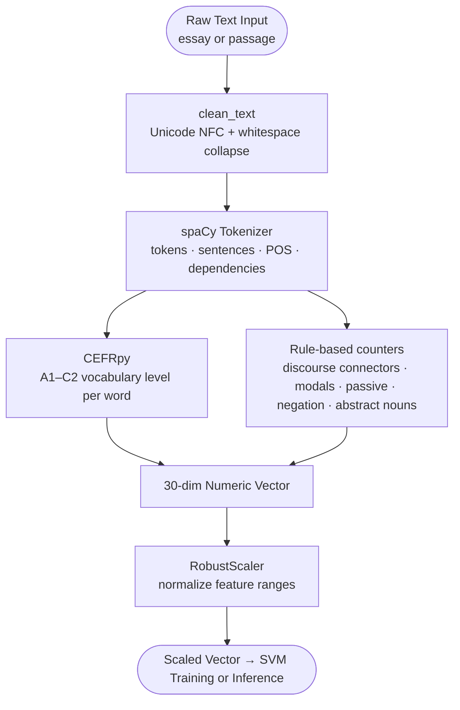
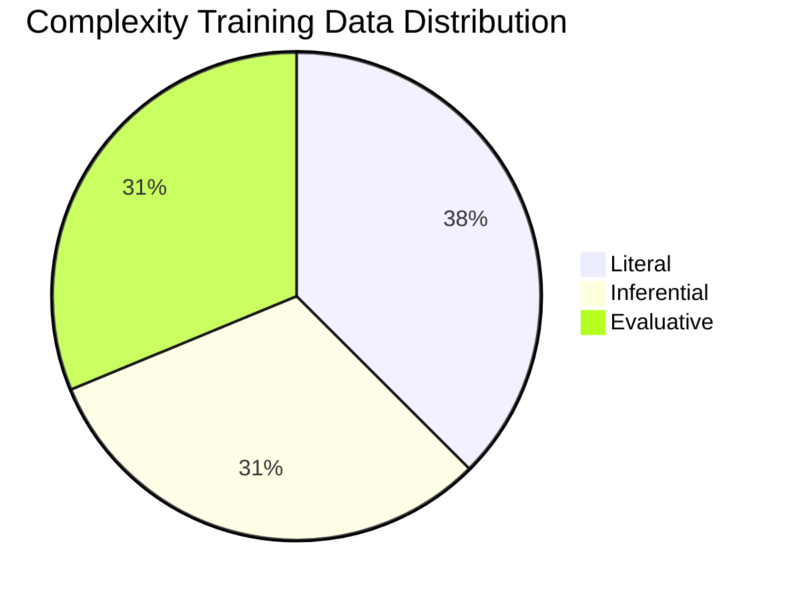

# Member 2: Data Reliability and Relevance
## ReadTrack Thesis Defense

**Area:** Data Sources, Quality, Preprocessing, and Suitability

---

### Opening Line

"I will cover the data portion of our defense. This includes where the data came from, why it is appropriate for the system, how it was cleaned and preprocessed, and what measures were taken to make sure it is reliable."

---

## Data Sources

| Dataset | Purpose | Why Appropriate |
|---|---|---|
| **Phil-IRI passages (64 total)** | Train the complexity model (Literal / Inferential / Evaluative) | Official DepEd-published reading inventory; 24 Literal, 20 Inferential, 20 Evaluative passages used to judge Grade 7 reading demand |
| **ASAP2 (1,145,716 essays)** | Train the proficiency model (Nagsisimula / Papaunlad / Mahusay) | Large-scale student essay dataset with human-scored proficiency levels |
| **Teacher-labeled samples (current set: 2)** | Ongoing model improvement via Verify and Train | Ground truth from actual Grade 7 classroom context; most directly relevant to the target users |

---

## Why the Data is Appropriate

- **Phil-IRI is the national standard.** Passages were written and graded by Philippine reading specialists to target specific complexity levels. Using Phil-IRI as training data means the system is calibrated to the exact standard teachers use in practice.
- **ASAP2 provides broad essay coverage.** It contains essays across diverse topics and grade levels, giving the proficiency model enough variety to generalize.
- **Teacher corrections are domain-specific.** When teachers flag predictions as wrong, the system saves those corrections. Retraining with these samples makes the model more accurate for the actual local classroom population.

---

## Data Flow: From Raw Text to Training Vector

---

## Data Cleaning and Preprocessing Steps

All text goes through the following pipeline before training or inference:

1. **Unicode normalization (NFC)**: ensures consistent character encoding, especially for Filipino diacritics.
2. **Whitespace collapse**: removes extra spaces, tabs, and newlines using regex.
3. **spaCy tokenization**: produces consistent token and sentence boundaries.
4. **CEFRpy vocabulary tagging**: assigns A1-C2 levels to English words; zeroed out for Filipino since CEFRpy is English-only.
5. **RobustScaler normalization**: scales the 30-dim vector to comparable ranges. RobustScaler was chosen over StandardScaler because it is resistant to outlier essays, very short or very long texts.
6. **Language detection**: English and Filipino texts are routed to different NLP paths so the correct set of features is computed.

---

## Data Reliability Measures

### Primary Reliability Argument

> **The strongest guarantee of reliability in ReadTrack is that every essay is evaluated by DepEd teachers, and that will remain true as the system grows.**

The system does not rely solely on automated scoring. DepEd teachers are the final evaluators of student essays. When a teacher rates an essay through the rubric, that rating becomes a verified ground truth label. Over time, the system accumulates a dataset of teacher-verified examples specific to the actual Grade 7 classroom population it is built for. This means:

- The model's predictions are always checked against real teacher judgment.
- Errors are not silent, teachers see the prediction, can override it, and their correction is recorded.
- Retraining uses teacher-labeled data, so the model continuously improves toward what actual DepEd teachers consider correct.

No matter how good or imperfect the initial training data is, the teacher-in-the-loop design ensures the system cannot permanently drift from classroom reality.

---

### Supporting Reliability Measures

| Measure | How it is applied |
|---|---|
| **DepEd teacher evaluation** | Every essay prediction is reviewed by the teacher; corrections are stored and used for retraining |
| Label consistency | Phil-IRI labels come from published materials directly, not crowd annotators, which removes inter-annotator disagreement |
| Train-test split | Complexity model evaluated on held-out data; in-sample accuracy of 98.48% is expected because Phil-IRI is the ground truth |
| Reproducibility | Fixed random seeds and versioned training scripts produce stable, repeatable results |
| Teacher override tracking | Original prediction and teacher correction are both stored, creating a growing edge-case dataset |
| Class balance strategy | `class_weight='balanced'` in the SVM prevents the model from favoring the majority class |

---

## Class Distribution: Complexity Model (Phil-IRI)

The Phil-IRI training set has 64 passages in total: 24 Literal, 20 Inferential, and 20 Evaluative. That near balance reduces the risk of class bias.

---

## Possible Limitations: Honest Answers

- **Filipino NLP is less mature.** calamanCy provides POS tagging but CEFR features are unavailable for Filipino. Filipino essays still use the same 30-feature vector, but the six CEFR slots are zeroed out, so those features carry no signal.
- **Phil-IRI data volume is limited.** The official dataset is not large by ML standards. This is why the model is trained in overfit mode on Phil-IRI because the labels are authoritative, not statistical estimates.
- **ASAP2 is English-centric.** The proficiency model may need Filipino-specific retraining as teacher-labeled Filipino essays accumulate.
- **Bias risk.** If Phil-IRI passages skew toward certain topics or writing styles, the complexity model may perform differently on very topic-specific classroom materials. The teacher confirmation modal addresses this by keeping a human in the loop.

---

## Q&A Reference

### E. Data Reliability and Validity

76. Q: Is the data reliable?
    A: Yes. Every essay in ReadTrack is reviewed by a DepEd teacher before its label is used for retraining. On top of that, the complexity labels come from Phil-IRI, the official national reading inventory, and we apply consistent preprocessing and class-balanced training throughout.

77. Q: How can we tell data is reliable?
    A: Phil-IRI labels come directly from DepEd-published materials, not crowdsourced or guessed. ASAP2 essays were scored by trained human raters. And every essay that enters ReadTrack's training pipeline is reviewed by a real DepEd teacher before its label is used.

78. Q: What is data quality checking?
    A: ReadTrack applies Unicode normalization and whitespace cleaning to every text before processing. This removes encoding errors and formatting noise that could distort the 30 feature values computed by spaCy and CEFRpy.

79. Q: Why are labels important for reliability?
    A: The SVM learns entirely from its labels. A wrong label teaches the model the wrong boundary. Phil-IRI labels come from the official DepEd-published source, which minimizes errors at the foundation of ReadTrack's complexity model.

80. Q: What is train-test split?
    A: Train-test split divides the data so the model trains on one portion and is evaluated on a separate portion it never saw. ReadTrack does this with ASAP2 data for the proficiency model, giving an honest estimate of how it will perform on new student essays.

81. Q: Why do we need unseen test data?
    A: Evaluating on training data gives scores that are too optimistic because the model already knows those examples. ReadTrack's proficiency model is evaluated on held-out ASAP2 essays to get a realistic accuracy. For the complexity model, high in-sample accuracy is expected because Phil-IRI is the authoritative standard.

82. Q: What is cross-validation?
    A: Cross-validation splits training data into several folds, trains on some folds, and validates on the rest, then averages the results. ReadTrack's GridSearchCV uses this internally when searching for the best C and gamma values for the SVM.

83. Q: Why use cross-validation?
    A: Phil-IRI and ASAP2 are not large datasets. Cross-validation makes the hyperparameter search more stable by testing each C and gamma combination across multiple data splits instead of relying on one that might be lucky or unlucky.

84. Q: What is data leakage?
    A: Data leakage happens when information from the test set influences the model before evaluation. ReadTrack prevents this by fitting RobustScaler only on training data, so the test set never influences the scaler's parameters.

85. Q: Why is leakage dangerous?
    A: Leakage makes evaluation scores look better than they really are. If ReadTrack's scaler saw test data during fitting, the reported accuracy would be unrealistically high, and the deployed model would perform worse on real classroom essays.

86. Q: How is leakage prevented?
    A: ReadTrack's training scripts fit RobustScaler only on X_train. The same fitted scaler is then applied to X_test and saved to scaler.pkl for inference time, so test data never influences the scaler's parameters.

87. Q: What is reproducibility?
    A: Reproducibility means running the same training script with the same data produces the same result. ReadTrack uses fixed random seeds in GridSearchCV and saves versioned pkl files, so anyone with the Phil-IRI data and train_complexity.py gets the same model and scores.

88. Q: How do we improve reproducibility?
    A: ReadTrack stores fixed random seeds, versioned training scripts in /scripts, and saves both model.pkl and scaler.pkl. Any developer with the same training data can run the scripts and reproduce the exact metrics shown on the About page.

89. Q: What is class imbalance?
    A: Class imbalance means one class has far more samples than the others, which can skew the model toward always predicting that class. The Phil-IRI dataset ReadTrack uses has 64 passages total: 24 Literal, 20 Inferential, and 20 Evaluative, which keeps the classes close enough to balanced to reduce this risk.

90. Q: Why is class imbalance risky?
    A: An imbalanced SVM learns to always predict the majority class. For ReadTrack, that would mean every passage gets labeled Literal regardless of its actual difficulty, making the system useless for DepEd teachers selecting Grade 7 materials.

91. Q: How is class imbalance addressed?
    A: ReadTrack sets class_weight='balanced' in the SVM so the model penalizes minority class errors more. Macro F1 is also reported alongside accuracy, so any remaining imbalance effect cannot hide behind a high overall score.

92. Q: What does reliable evaluation look like?
    A: Reliable evaluation shows multiple metrics, not just one number. ReadTrack's About page displays accuracy, per-class F1, macro F1, and weighted F1, all computed from a proper train-test split, not from the same data used for training.

93. Q: What is error analysis?
    A: Error analysis means studying which samples the model got wrong and why. For ReadTrack, it showed that Inferential passages overlap with both Literal and Evaluative in the feature space, and that finding directly led us to add 6 new discriminating features.

94. Q: What should be shown in error analysis?
    A: Error analysis should show which classes are confused most and why. For ReadTrack, Inferential and Literal sat closest together in the feature space. That gap led us to add discourse connector ratio, passive ratio, modal ratio, and abstract noun ratio, features that are noticeably stronger in Inferential and Evaluative texts.

95. Q: What is a practical reliability statement?
    A: ReadTrack's reliability comes from keeping DepEd teachers in control. The SVM predicts, but the teacher reviews and decides, and every teacher decision becomes labeled data that makes the model more accurate for the next class.

---

## Closing Line

"The most important thing to understand about data reliability in ReadTrack is this: every essay is evaluated by DepEd teachers, and that will continue as the system is used. The model does not make the final call, the teacher does. That teacher judgment becomes labeled data, which is used to retrain the model, which makes it more accurate for the next class. Beyond that, we used Phil-IRI as our training standard because it is the official national reading inventory, and we applied consistent preprocessing, class-balanced training, and transparent F1 reporting to support that foundation."
