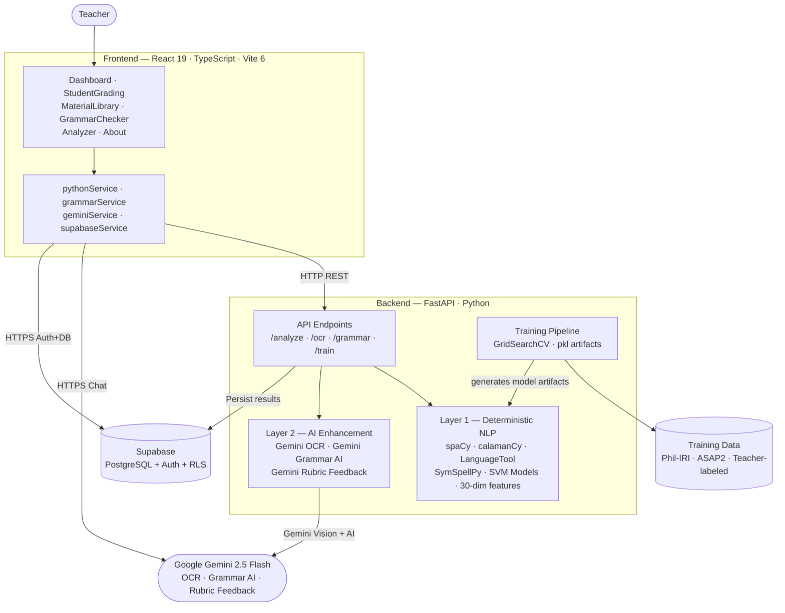
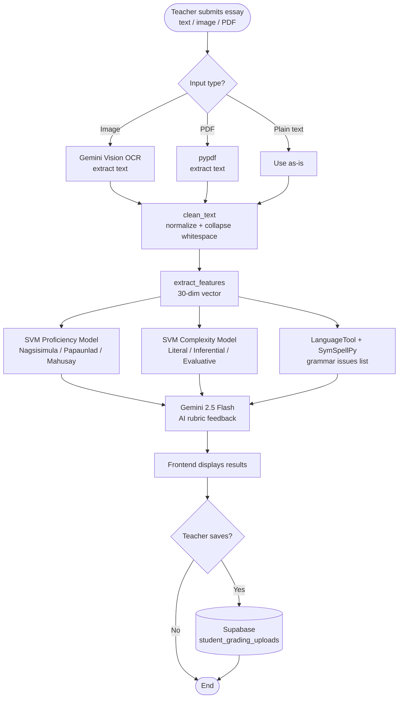
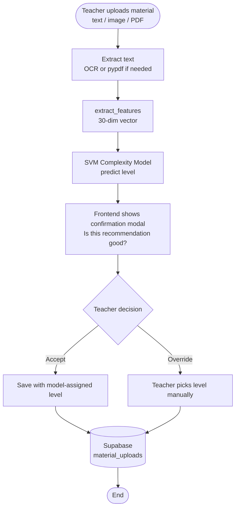
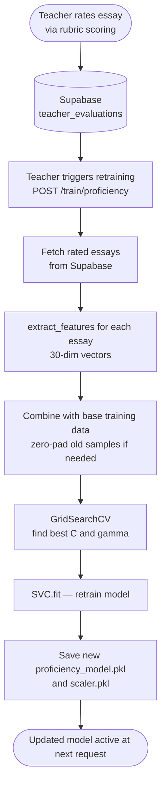
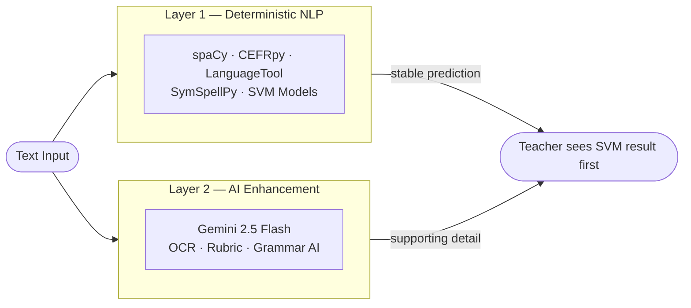

# Member 3 — System Design and Workflow
## ReadTrack Thesis Defense

**Area:** Architecture, Implementation, Frontend, Backend, AI Services, and Overall Workflow

---

### Opening Line

"I will cover the system design portion of our defense. This includes how the frontend, backend, AI services, and database work together, why the architecture was built this way, and what its limitations are."

---

## Architecture Overview

ReadTrack has four layers:

| Layer | Technology | Role |
|---|---|---|
| Frontend | React 19 + TypeScript + Vite 6 | User interface — input essays, display results, upload materials, view dashboard |
| Backend | FastAPI + Python + Uvicorn | NLP processing, ML inference, OCR, grammar check, training endpoints |
| AI Services | Google Gemini 2.5 Flash | OCR from images, rubric feedback generation, context-aware grammar corrections |
| Database | Supabase (PostgreSQL + Auth + RLS) | Store essays, materials, teacher evaluations, and grading history |

---

## System Architecture Diagram

---

## End-to-End Flow: Student Essay Grading

---

## End-to-End Flow: Material Upload

---

## End-to-End Flow: Model Retraining

---

## Key Backend Endpoints

| Endpoint | Purpose |
|---|---|
| `POST /analyze/student` | Proficiency SVM prediction + grammar check |
| `POST /analyze/complexity` | Complexity SVM prediction + full 30 features |
| `POST /analyze/rubric` | Gemini rubric scoring (5 criteria) |
| `POST /ocr/extract` | Gemini Vision OCR from image or PDF |
| `POST /reference/ingest` | Material upload + complexity classification |
| `POST /train/proficiency` | Retrain proficiency model with teacher-rated essays |
| `GET /api/evaluation` | Return model accuracy, F1, and metrics |

---

## Two-Layer Processing Design

Layer 1 gives deterministic, reproducible results — the same input always produces the same SVM prediction. Layer 2 adds contextual AI explanation on top. Teachers always see the SVM result first; AI output is supporting detail, not the final answer.

---

## Why This Architecture

- **FastAPI** — fast, async-compatible, and has automatic API documentation. Runs alongside Python ML libraries on a single server.
- **Supabase** — gives PostgreSQL with built-in authentication and row-level security without needing a separate auth system.
- **Gemini 2.5 Flash** — handles tasks requiring contextual language understanding (OCR, rubric generation) where rule-based systems would be insufficient.
- **Two-layer model** — separates stable, reproducible SVM outputs from contextual AI outputs. This keeps the system trustworthy even when the AI gives inconsistent responses.
- **Confirmation modal for materials** — instead of silently auto-saving the model's prediction, the teacher is asked to confirm. This keeps human oversight in the loop and collects override data for future retraining.

---

## Limitations of the Architecture

- **Single-server backend** — FastAPI handles NLP, ML inference, and AI calls. Under high concurrent load, spaCy processing could become a bottleneck.
- **Gemini API dependency** — OCR and rubric feedback require internet connectivity and an active Gemini API key. Offline use is not supported for those features.
- **Model retraining is manual** — teachers must trigger retraining through the interface. Automated scheduled retraining is not yet implemented.
- **Filipino NLP gap** — calamanCy provides POS tagging but CEFR vocabulary features are unavailable for Filipino, reducing feature richness for Filipino essays.

---

## Q&A Reference

### B. Pipeline and System Flow

21. Q: What is the basic ReadTrack flow?
    A: A teacher submits an essay or passage through the frontend. The FastAPI backend extracts 30 features using spaCy and CEFRpy, passes them to the SVM, and returns a proficiency level and a complexity level. Gemini adds rubric feedback, and the teacher saves everything to Supabase.

22. Q: What inputs are supported?
    A: Teachers can submit plain text typed directly, images processed by Gemini Vision OCR, or PDFs processed by pypdf. All three input types become plain text before spaCy and the SVM run.

23. Q: How is image text handled?
    A: The teacher uploads the image, the frontend calls POST /ocr/extract, and the backend sends the image to Gemini Vision. Gemini returns the extracted text, which then goes through the same clean_text and extract_features pipeline as any other input.

24. Q: Why is language selection important?
    A: English essays use spaCy and CEFRpy for all 30 features, while Filipino essays use calamanCy for POS tagging and skip CEFRpy since it only works in English. If the wrong language is selected, the wrong features are computed and the SVM prediction may be inaccurate.

25. Q: What English NLP tools are used?
    A: For English essays, ReadTrack uses spaCy en_core_web_sm for tokenization, POS tagging, and dependency parsing; CEFRpy for A1–C2 vocabulary levels; LanguageTool for grammar rules; and SymSpellPy for spelling correction — all running locally on the FastAPI server.

26. Q: What Filipino NLP tool is used?
    A: ReadTrack uses calamanCy tl_calamancy_md — a Filipino language model built on spaCy — for POS tagging and dependency parsing. CEFRpy does not support Filipino, so the 6 CEFR vocabulary features are set to zero for Filipino essays.

27. Q: What does CEFR-based feature mean?
    A: CEFRpy assigns each English word a level from A1 (basic) to C2 (advanced). ReadTrack counts the proportion of words at each level. A passage with many C1–C2 words will have a higher advanced word ratio, which signals higher complexity to the SVM.

28. Q: Why do we need feature extraction?
    A: The SVM works with numbers, not text. extract_features() converts the essay into 30 numeric values — sentence length, vocabulary level, verb ratio, discourse connectors, and so on. Without this step, the SVM has nothing to work with.

29. Q: What does the model output aside from class?
    A: The SVM returns the predicted level — for example, Inferential — and can also output probability estimates. ReadTrack uses this to show a confidence indicator so teachers know when a prediction is borderline.

30. Q: Why use confidence?
    A: When the SVM is close to the boundary between two classes — say, Inferential and Evaluative — the confidence is lower. The teacher sees this and knows to look more carefully at the material before accepting the prediction.

31. Q: What is deterministic processing?
    A: The spaCy and SVM pipeline always produces the same output for the same input. If a teacher submits the same essay twice, the proficiency and complexity levels will be identical. This makes the system predictable and auditable.

32. Q: Why include deterministic parts?
    A: Teachers need to trust the system. If the SVM gave different answers each time for the same essay, teachers could not rely on it. The deterministic NLP and SVM layer ensures consistent, reproducible results.

33. Q: Why include AI enhancement?
    A: The SVM gives a class label. It cannot explain why an essay is Papaunlad or write a rubric comment. Gemini 2.5 Flash fills that gap — it generates the rubric feedback, explains grammar issues in context, and extracts text from images.

34. Q: Is AI output final?
    A: No. The Gemini rubric feedback and grammar suggestions are shown to the teacher as supporting information. The teacher reviews them and decides what to accept. The SVM prediction is the primary output; Gemini is the explanation layer.

35. Q: What is human-in-the-loop?
    A: In ReadTrack, it means DepEd teachers see every prediction before it is saved. For essays, the teacher reviews the proficiency and complexity levels. For materials, the teacher confirms or overrides the suggested level in the confirmation modal. Teacher decisions are stored and used for retraining.

### F. ReadTrack-Specific Defense Points

96. Q: What is the main ML contribution of ReadTrack?
    A: ReadTrack combines two SVM classifiers in one workflow — one for student proficiency and one for text complexity. A teacher submits one essay and gets both predictions together, which saves time compared to evaluating each manually.

97. Q: What is the main NLP contribution of ReadTrack?
    A: ReadTrack converts both English and Filipino student essays into a 30-dimensional numeric feature vector using spaCy, CEFRpy, and rule-based heuristics. This bridges the gap between raw text and the numeric format that the SVM needs.

98. Q: Why is hybrid design useful here?
    A: The SVM handles structured scoring fast and consistently. Gemini handles open-ended language tasks like rubric writing and OCR. Combining both gives teachers a complete output — a level prediction and a written explanation — in one request.

99. Q: What does Verify and Train do in simple terms?
    A: When a teacher rates an essay, that rating is saved to Supabase. When the teacher clicks retrain, the system fetches all rated essays, extracts their features, combines them with the base training data, and calls SVC.fit() again. The model updates and new metrics appear on the About page.

100. Q: Why is teacher correction valuable for ML?
     A: The ASAP2 and Phil-IRI data were labeled by raters who are not Grade 7 DepEd teachers. When a DepEd teacher corrects a prediction, that label is more relevant to the actual classroom context ReadTrack is built for. Over time, these corrections shift the model toward local ground truth.

101. Q: What role does confidence play in classroom use?
     A: If the SVM outputs a low-confidence prediction — for example, between Inferential and Evaluative — the teacher is signaled to check the material more carefully. This makes sure borderline predictions get human review instead of being accepted automatically.

102. Q: Can the system replace teacher grading?
     A: No. ReadTrack gives a prediction and rubric feedback to help the teacher work faster and more consistently. The teacher still reviews the prediction, adjusts the rubric scores, and makes the final judgment. The system is a tool, not a replacement.

103. Q: What is a safe way to present model accuracy?
     A: Show accuracy together with per-class F1, precision, recall, and the confusion matrix. ReadTrack's About page does this. It shows that the complexity model reaches 98.48% on Phil-IRI data, and explains that this is expected because Phil-IRI is the official standard the model was calibrated to.

104. Q: Why highlight limitations in defense?
     A: Because the panel will ask about them regardless. Stating the limitations honestly — such as the Filipino NLP gap and the limited Phil-IRI dataset size — shows that the group understands the system deeply and has thought about its real-world deployment.

105. Q: What limitation should be stated for Filipino NLP?
     A: CEFRpy does not support Filipino, so 6 of the 30 features — the CEFR word ratios — are set to zero for Filipino essays. This reduces the feature richness for Filipino text. calamanCy handles POS tagging, but vocabulary sophistication cannot be measured the same way as in English.

106. Q: What is the next ML improvement step?
     A: Collect more teacher-labeled Filipino essays and retrain the proficiency model with them. The current proficiency model was initialized on ASAP2 which is English-dominant. More Filipino-labeled data will improve accuracy for Filipino essay submissions.

107. Q: What is the next NLP improvement step?
     A: Integrate a Filipino vocabulary level resource to replace the zero-padded CEFR features for Filipino text. This would give the SVM more informative features for Filipino essays and improve classification accuracy for Filipino-language inputs.

108. Q: What should you say if asked about trust?
     A: ReadTrack is trustworthy because every prediction is reviewed by a DepEd teacher before it is stored. The metrics are reported honestly on the About page with per-class F1 — not just a single accuracy number. And the system improves over time as teachers provide corrections.

109. Q: What should you say if asked about fairness?
     A: We check per-class F1 so no single level dominates the evaluation. We use class_weight='balanced' so minority classes are not ignored during training. And we report macro F1 which gives equal weight to Literal, Inferential, and Evaluative.

110. Q: What is your short final defense line?
     A: ReadTrack uses spaCy and SVM to give teachers fast, consistent level predictions for essays and reading materials. The teacher always reviews and confirms the output. That combination of automatic prediction and teacher oversight is what makes the system both practical and reliable for Grade 7 classrooms.

---

## Closing Line

"ReadTrack's architecture is designed around one principle: teachers stay in control. The system is fast because it uses deterministic NLP and SVM at its core. It is rich because Gemini adds contextual feedback on top. And it is trustworthy because every major prediction — proficiency level, complexity level, material classification — goes through the teacher before it is stored. The system supports the teacher; it does not replace them."
