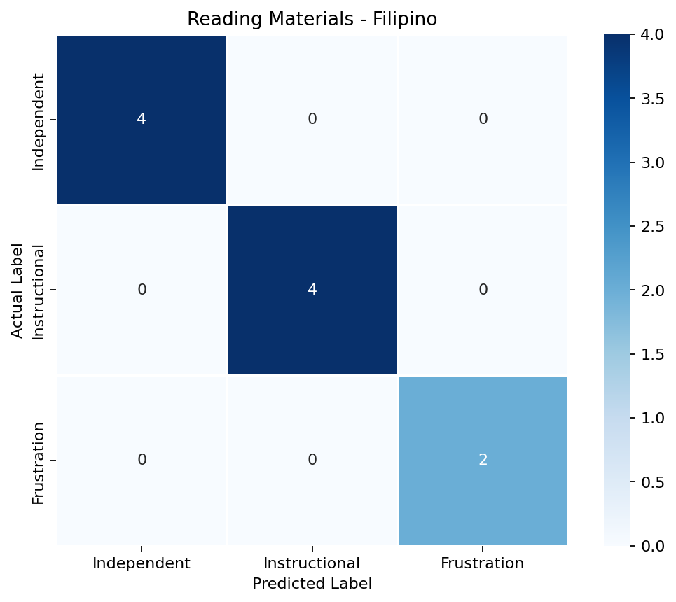
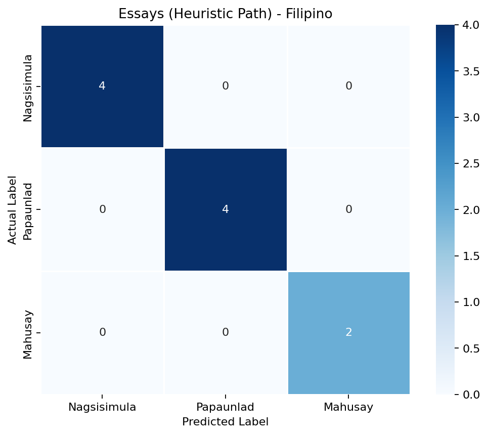
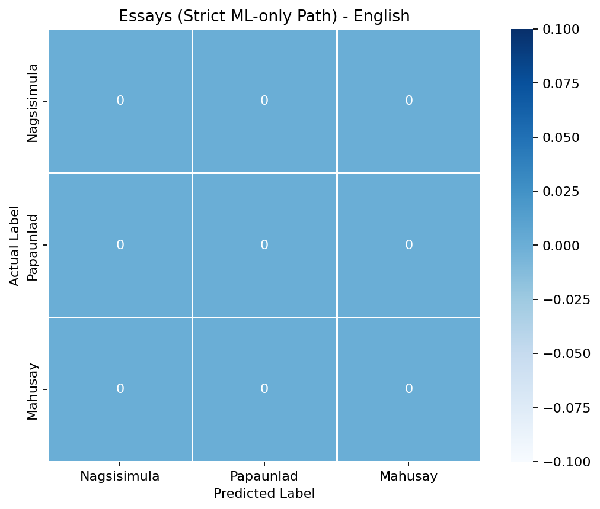

# ReadTrack F1 Score and Confusion Matrix Report

Source file: docs/f1_eval_results.json
Generated at (UTC): 2026-04-20T01:43:33.296734Z
Evaluation protocol: held-out split in docs/f1_eval_protocol.json

## Scope

This report includes all evaluated model paths for:
- Reading Materials
- Student Essays (Heuristic Path)
- Student Essays (Strict ML-only Path)

Language breakdowns are included for:
- English
- Filipino

## Dataset Size and Limitation

| Metric | Reading Materials | Essays - Heuristic Path | Essays - Strict ML-only Path |
|---|---:|---:|---:|
| Full evaluation count (all splits) | 20 | 20 | 20 |
| Held-out test count (used in Section A) | 12 | 12 | 12 |
| Per-language count (English / Filipino) | 10 / 10 | 10 / 10 | 10 / 10 |

Important: This is still a relatively small evaluation set. A single misclassification changes each held-out test F1 by about $1/12 \approx 0.0833$, and each per-language F1 by about $1/10 = 0.1000$.

## Label Order Used in Confusion Matrices

### Reading Materials
1. Independent
2. Instructional
3. Frustration

### Student Essays
1. Nagsisimula
2. Papaunlad
3. Mahusay

## A. Held-out Test F1 Scores (Primary)

| Model Path | Test Count (n) | Accuracy | Macro Precision | Macro Recall | Macro F1 |
|---|---:|---:|---:|---:|---:|
| Reading Materials | 12 | 1.0000 | 1.0000 | 1.0000 | 1.0000 |
| Essays - Heuristic Path | 12 | 1.0000 | 1.0000 | 1.0000 | 1.0000 |
| Essays - Strict ML-only Path | 12 | 0.0000 | 0.0000 | 0.0000 | 0.0000 |

### A1. Reading Materials Class-level F1 (Held-out Test)

| Model Path | Independent F1 | Instructional F1 | Frustration F1 | Macro F1 |
|---|---:|---:|---:|---:|
| Reading Materials | 1.0000 | 1.0000 | 1.0000 | 1.0000 |

### A2. Student Essays Class-level F1 (Held-out Test)

| Model Path | Nagsisimula F1 | Papaunlad F1 | Mahusay F1 | Macro F1 |
|---|---:|---:|---:|---:|
| Essays - Heuristic Path | 1.0000 | 1.0000 | 1.0000 | 1.0000 |
| Essays - Strict ML-only Path | 0.0000 | 0.0000 | 0.0000 | 0.0000 |

## B. English and Filipino F1 Scores (Per Language)

These per-language values come from the by_language metrics block in docs/f1_eval_results.json.

| Model Path | Language | Count (n) | Accuracy | Macro F1 |
|---|---|---:|---:|---:|
| Reading Materials | English | 10 | 1.0000 | 1.0000 |
| Reading Materials | Filipino | 10 | 1.0000 | 1.0000 |
| Essays - Heuristic Path | English | 10 | 1.0000 | 1.0000 |
| Essays - Heuristic Path | Filipino | 10 | 1.0000 | 1.0000 |
| Essays - Strict ML-only Path | English | 10 | 0.0000 | 0.0000 |
| Essays - Strict ML-only Path | Filipino | 10 | 0.0000 | 0.0000 |

## C. F1 Score Calculation (TP, FP, FN)

The following tables show the direct F1 computation using:

- Precision $= \frac{TP}{TP + FP}$
- Recall $= \frac{TP}{TP + FN}$
- F1 Score $= \frac{2 \cdot \text{Precision} \cdot \text{Recall}}{\text{Precision} + \text{Recall}}$

When $TP + FP = 0$, precision is reported as $0.0000$ following zero-division-safe scoring.

### C1. Reading Materials (Held-out Test) - Class-level Calculation

| Class | TP | FP | FN | Precision | Recall | F1 |
|---|---:|---:|---:|---:|---:|---:|
| Independent | 4 | 0 | 0 | 1.0000 | 1.0000 | 1.0000 |
| Instructional | 4 | 0 | 0 | 1.0000 | 1.0000 | 1.0000 |
| Frustration | 4 | 0 | 0 | 1.0000 | 1.0000 | 1.0000 |
| Macro Average | - | - | - | 1.0000 | 1.0000 | 1.0000 |

### C2. Essays - Heuristic Path (Held-out Test) - Class-level Calculation

| Class | TP | FP | FN | Precision | Recall | F1 |
|---|---:|---:|---:|---:|---:|---:|
| Nagsisimula | 4 | 0 | 0 | 1.0000 | 1.0000 | 1.0000 |
| Papaunlad | 4 | 0 | 0 | 1.0000 | 1.0000 | 1.0000 |
| Mahusay | 4 | 0 | 0 | 1.0000 | 1.0000 | 1.0000 |
| Macro Average | - | - | - | 1.0000 | 1.0000 | 1.0000 |

### C3. Essays - Strict ML-only Path (Held-out Test) - Class-level Calculation

| Class | TP | FP | FN | Precision | Recall | F1 |
|---|---:|---:|---:|---:|---:|---:|
| Nagsisimula | 0 | 0 | 4 | 0.0000 | 0.0000 | 0.0000 |
| Papaunlad | 0 | 0 | 4 | 0.0000 | 0.0000 | 0.0000 |
| Mahusay | 0 | 0 | 4 | 0.0000 | 0.0000 | 0.0000 |
| Macro Average | - | - | - | 0.0000 | 0.0000 | 0.0000 |

## D. Confusion Matrices by Model and Language

### D1. Reading Materials - English

Description: The English reading materials matrix is perfectly diagonal, showing all Independent, Instructional, and Frustration samples were correctly classified with no cross-class errors.

### D2. Reading Materials - Filipino

Description: The Filipino reading materials matrix is also fully diagonal, indicating perfect prediction for all three complexity levels.

### D3. Essays (Heuristic Path) - English

Description: The English essay heuristic-path matrix is perfectly diagonal, with all Nagsisimula, Papaunlad, and Mahusay essays classified correctly.

### D4. Essays (Heuristic Path) - Filipino

Description: The Filipino essay heuristic-path matrix is likewise fully diagonal, indicating no observed misclassification in this held-out set.

### D5. Essays (Strict ML-only Path) - English

Description: All in-label cells are zero because strict ML-only predictions were mapped outside the expected label set (recorded as Unknown), so no counts entered the 3x3 matrix.

### D6. Essays (Strict ML-only Path) - Filipino

Description: The Filipino strict ML-only matrix also contains only zeros for the same reason: predictions fell outside the evaluated class labels.

## E. Discussion of Results

The held-out test results show two clearly different behaviors across model paths. The reading materials model and the essay heuristic path both achieve perfect class-level precision, recall, and F1 in this evaluation file, resulting in macro F1 values of 1.0000. In contrast, the strict ML-only essay path yields zero scores across all in-label classes because predictions were outside the evaluated label set and were recorded as Unknown.

These outcomes are consistent with the confusion matrices and with the TP/FP/FN calculations in Section C. The strict ML-only path does not accumulate in-label true positives, so recall remains zero for every class, and precision is also zero under zero-division-safe scoring.

Because the dataset is small, these values should be interpreted as preliminary rather than final generalization evidence. Additional held-out samples are recommended to produce more stable F1 estimates.

## F. Notes

- Heuristic path means the production essay scorer in `StudentProficiencySVM.predict`: it uses weighted writing metrics (for example grammar, vocabulary, structure, discourse) and threshold rules to assign Nagsisimula/Papaunlad/Mahusay.
- Complexity model training reference (actual count): 64 Phil-IRI-labeled passages were used as base data (Literal=24, Inferential=20, Evaluative=20).
- Essay model initial training reference (actual count): ASAP2 was used as the baseline source, with 24,721 essays yielding valid feature vectors in the training pipeline (from 24,728 raw rows in ASAP2_train_sourcetexts.csv).
- ASAP2 score-to-label mapping used in training: score 1-2 -> Nagsisimula, score 3-4 -> Papaunlad, score 5-6 -> Mahusay.
- The strict ML-only essay path currently outputs labels outside the expected classes (recorded as Unknown in docs/f1_eval_results.json), which yields zero in-label confusion matrix counts and zero macro F1.
- The production essay path (heuristic path) and reading material model both show perfect held-out test performance in this evaluation set.
